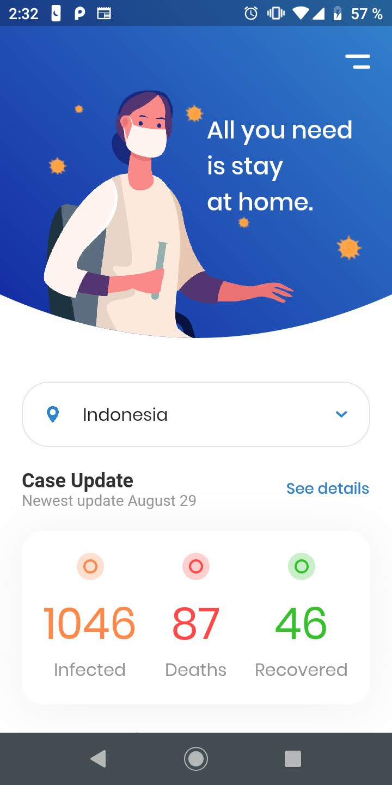
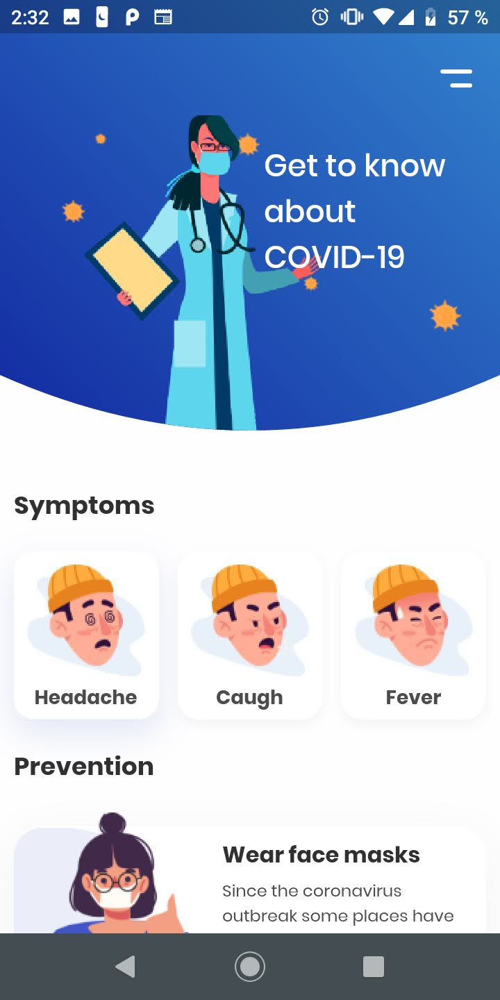
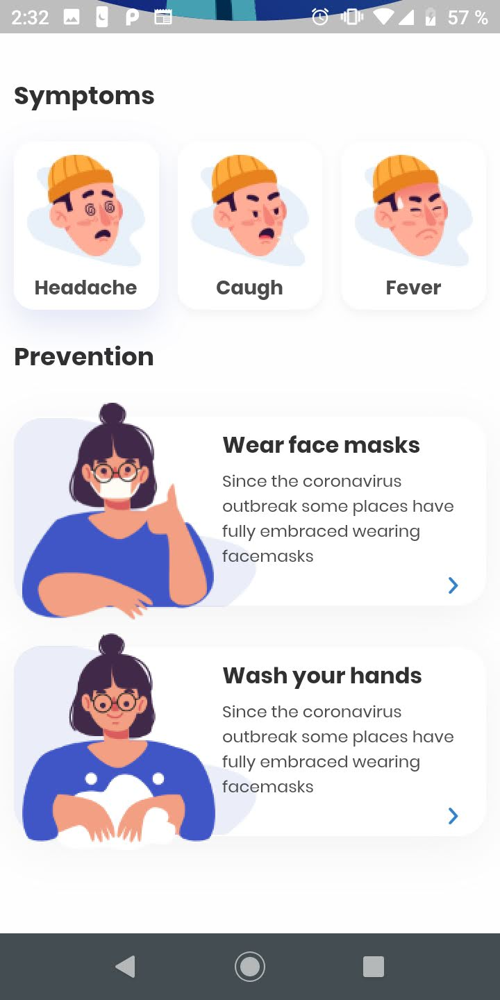

## Cov-vida

Cov-vida se hace como una aplicacion movil a modo de mantenerse actualizados e informados sobre lo que sucede en cada uno de los estados de México.

## Trabajo actual

## Lista de tareas por hacer:
- Traducir el contenido a español
- Agregar lista de los estados de México
- Actualizar los casos en la app diariamente
- Agregar mapas de cada estado de México
- Crear pantalla de detalle de la actualizacion de mapas (graficas de evolucion de contagios, decesos, recuperados y semaforo)
- Crear pantalla de detalle de Prevencion
- Toggle al boton del menu principal

## Como contribuir

- Realiza el FORK de este repositorio en tu cuenta de GitHub
- Clona tu repositorio en tu computadora
- Crea una nueva rama tuya 
- Ingresa a la rama que acabas de crear
- Escribe el codigo que desees
- Haz el commit de tus cambio, escribiendo el titulo con las actividades que realizaste y explayandote en la descripcion.
- Has PUSH 
- Pide un PULL REQUEST
- Espera a que el PULL REQUEST se apruebe. En caso de que no se apruebe, se te comentara por que.
- Listo!